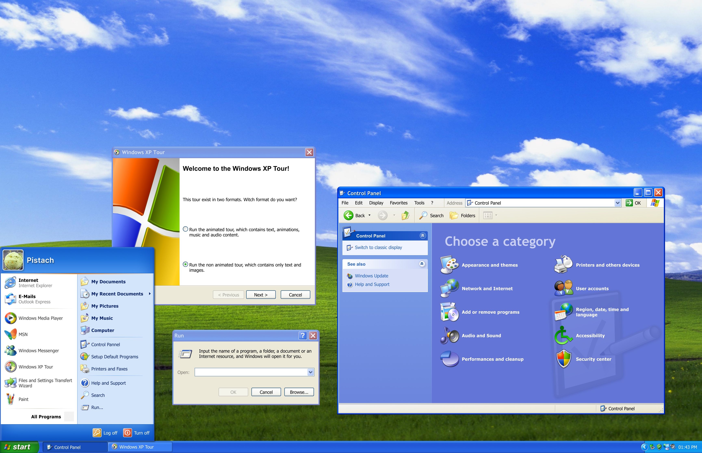

# Windows XP UI Kit for Figma

This Kit can help you quickly compose windows and frames for your designs and renders that need a Windows XP, Luna Style.

- Pick iconic Windows XP controls and UI elements from the Assets Library
- Most Controls and Visual Element has been recreated with Vector in mind, so anything can scale
- Commons icons are included in the library
- Build your windows from my Templates and Examples
- Showcase your design on field with the provided Desktop and the Start Menu

[License CC-BY-NC-ND-4](LICENSE)