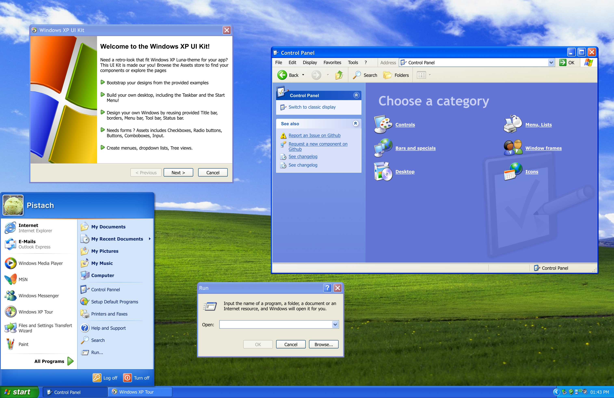

# Windows XP UI Kit for Figma

This Kit can help you quickly compose windows and frames for your designs and renders that need a Windows XP Style.

- Pick up from the Assets Library any component and style using the Luna theme
- Most Controls and Visual Element has been recreated with Vector in mind, so anything can scale
- Commons icons are included in the Assets
- Build your Windows from the Templates and examples provided
- Show your design with the Desktop and even the Start Menu

## Showcases

- [License CC-BY-NC-ND-4](LICENSE)